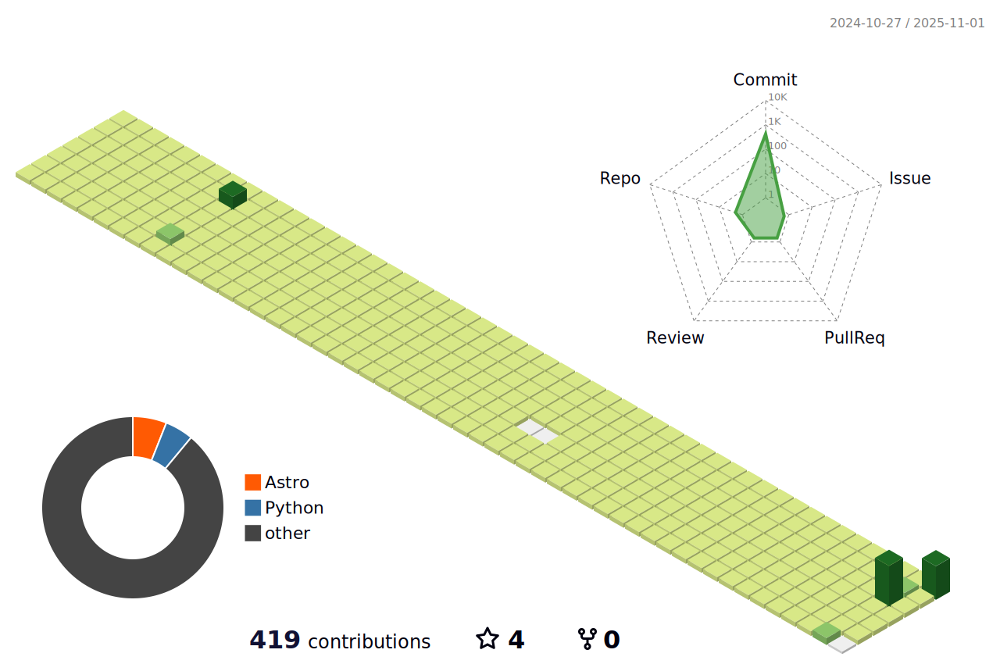

Hi, I'm currently doing master's degree in Industrial System Engineering from Dongguk University

### Interest
- Generative Model
- Anomaly detection in industry field
- Genetic algorithms
- Machine learning for semiconductor
- **Domain Generalization**

### Experience
#### Teaching positions

|Date|Subject|Organization|
|:-------------:|:-------:|------------|
|Mar 21-Jul 21|Machine Learning|Dongguk Univ, Department of Industrial System Engineering|
|Sep 21-Dec 21|Advanced Machine Learning|Graduate School of Dongguk Univ, Department of Industrial System Engineering|
|Mar 22-Jul 22|Machine Learning|Dongguk Univ, Department of Industrial System Engineering|
|Mar 22-Jul 22|Advanced Data Science|Graduate School of Dongguk Univ, Department of Industrial System Engineering|
|Mar 22-Jul 22|Introduction to Financial Engineering|Dongguk Univ, Department of Industrial System Engineering|

<!--
**andrew0411/andrew0411** is a ✨ _special_ ✨ repository because its `README.md` (this file) appears on your GitHub profile.

Here are some ideas to get you started:

- 🔭 I’m currently working on ...
- 🌱 I’m currently learning ...
- 👯 I’m looking to collaborate on ...
- 🤔 I’m looking for help with ...
- 💬 Ask me about ...
- 📫 How to reach me: ...
- 😄 Pronouns: ...
- ⚡ Fun fact: ...
-->
